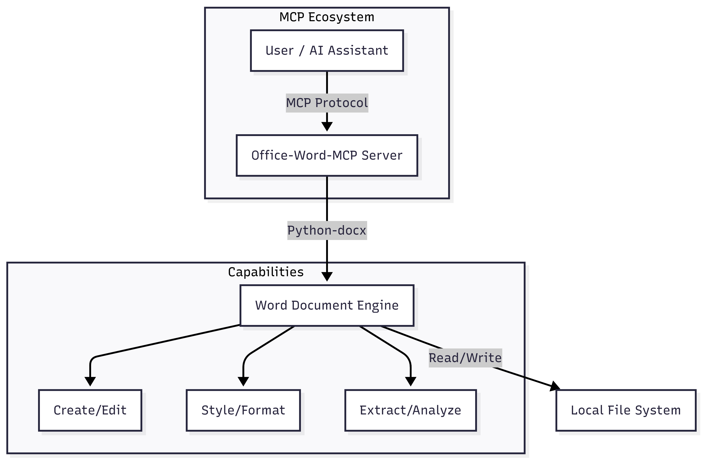

# Office-Word-MCP


[](https://smithery.ai/server/@GongRzhe/Office-Word-MCP-Server)

**Enterprise-Grade Document Automation Protocol for Amazon Q & Kiro**

## Overview

**Office-Word-MCP** is a robust Model Context Protocol (MCP) server designed to enable advanced document processing capabilities for AI assistants like **Amazon Q Developer**, **Kiro**, and other MCP-compliant clients.

It provides a standardized interface for AI agents to programmatic create, read, manipulate, and analyze Microsoft Word documents (`.docx`). By abstracting complex document object models into clean API tools, it empowers AI assistants to generate professional reports, contracts, and documentation workflows autonomously.

### Key Benefits

- **Seamless Integration**: Optimized for Amazon Q and Kiro environments.
- **Rich Formatting**: Support for complex tables, styling, and layout controls.
- **Enterprise Ready**: Includes document protection, comment analysis, and structured data handling.
- **Secure**: Runs locally with explicit permission controls.

## Architecture



## Features

### 1. Document Management

- **Lifecycle Control**: Create, copy, merge, and convert documents (to PDF).
- **Structure Analysis**: Extract outlines, metadata, and statistics.
- **Security**: Apply password protection and manage restricted editing.

### 2. Content Engineering

- **Advanced Tables**: Create complex layouts with merges, shading, and custom borders.
- **Rich Text**: precision control over fonts, colors, and paragraph styles.
- **Media**: Insert images with proportional scaling.
- **Dynamic Lists**: XML-compliant bulleted and numbered lists.

### 3. Review & Collaboration

- **Comment Mining**: Extract and filter comments by author or content.
- **Track Changes**: (Future roadmap) Support for revision tracking.

## Getting Started

### Prerequisites

- Python 3.10 or higher
- `uv` (recommended) or `pip` package manager

### Installation

#### Option 1: Using `uvx` (Recommended for ephemeral use)

No installation required. You can run the server directly using `uvx`.

```bash
uvx --from office-word-mcp-server word_mcp_server
```

#### Option 2: Local Installation

Clone the repository and install dependencies:

```bash
git clone https://github.com/GongRzhe/Office-Word-MCP-Server.git
cd Office-Word-MCP-Server
pip install -r requirements.txt
```

## Integration Guide

### Amazon Q Developer (VS Code / JetBrains)

To integrate Office-Word-MCP with Amazon Q Developer:

1.  Open your IDE settings and navigate to **Amazon Q** > **MCP Servers**.
2.  Add a new server configuration:
    - **Name**: `word-automation`
    - **Command**: `uvx`
    - **Args**: `--from`, `office-word-mcp-server`, `word_mcp_server`
3.  Restart your IDE. Amazon Q will now have access to Word tools.

### Kiro

Configure the server in your Kiro settings or configuration file:

```json
{
  "mcpServers": {
    "office-word": {
      "command": "uvx",
      "args": ["--from", "office-word-mcp-server", "word_mcp_server"]
    }
  }
}
```

### Other MCP Clients (Claude Desktop, etc.)

Add the following to your MCP configuration file (e.g., `claude_desktop_config.json`):

```json
{
  "mcpServers": {
    "word-server": {
      "command": "uvx",
      "args": ["--from", "office-word-mcp-server", "word_mcp_server"]
    }
  }
}
```

## API Reference

The server exposes the following tools to the AI assistant.

### Core Operations

| Tool Name                  | Description                                    |
| -------------------------- | ---------------------------------------------- |
| `create_document`          | Create a new blank or template-based document. |
| `get_document_text`        | Extract all text content from a file.          |
| `list_available_documents` | Scan directory for valid Word files.           |
| `convert_to_pdf`           | Export .docx to PDF format.                    |

### Content & Formatting

| Tool Name       | Description                                      |
| --------------- | ------------------------------------------------ |
| `add_heading`   | Insert structured headings (Levels 1-9).         |
| `add_paragraph` | Add text blocks with style support.              |
| `add_table`     | Create a new table structure.                    |
| `format_text`   | Apply bold, italic, color, etc., to text ranges. |

### Table Management

| Tool Name                | Description                                   |
| ------------------------ | --------------------------------------------- |
| `format_table`           | Apply styles, borders, and shading to tables. |
| `merge_table_cells`      | Merge cells horizontally or vertically.       |
| `set_table_column_width` | Precise control over column dimensions.       |

_(See full tool list in `word_mcp_server.py` source)_

## Troubleshooting

### Common Issues

**Permission Denied**

- **Cause**: The server cannot access the file system.
- **Fix**: Ensure the running process has R/W access to the target directory. On Windows, ensure the file isn't open in Microsoft Word.

**Styling Not Applied**

- **Cause**: Using a style name that doesn't exist in the base template.
- **Fix**: Use `create_custom_style` to define the style before using it, or use standard Word styles (e.g., "Normal", "Heading 1").

**Image Insertion Failures**

- **Cause**: Relative paths may be ambiguous.
- **Fix**: Always use **absolute paths** for images.

### Debugging

Set the `MCP_DEBUG` environment variable to `1` to enable verbose logging:

```bash
# Windows (PowerShell)
$env:MCP_DEBUG = "1"
```

## License

This project is licensed under the MIT License. See [LICENSE](LICENSE) for details.

---

_Built for the Agentic Era._
